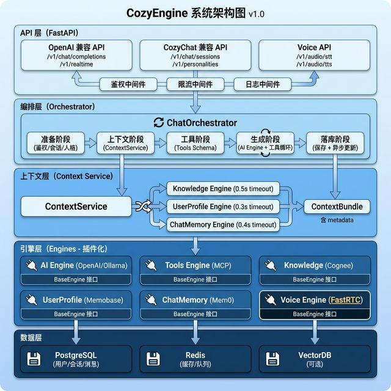

# CozyEngine 系统架构图说明

> **文档版本**: v1.0  
> **创建日期**: 2026-02-09  
> **配套文档**: CozyEngine-架构评审报告-v1.0-2026-02-09.md  

---

## 架构图概览



---

## 分层架构说明

### 🔵 Layer 1: API 层 (FastAPI)

**职责**: HTTP/WebSocket 协议适配与鉴权

**核心组件**:

1. **OpenAI 兼容 API**
   - `/v1/chat/completions` - 标准对话接口（流式/非流式）
   - `/v1/realtime` - Realtime 双向语音对话（WebSocket）
   - 完全兼容 OpenAI API 规范

2. **CozyChat 兼容 API**
   - `/v1/chat/sessions` - 会话管理
   - `/v1/personalities` - 人格管理
   - 保持 CozyChat 前端兼容性

3. **Voice API**
   - `/v1/audio/stt` - 语音转文字（HTTP + WebSocket）
   - `/v1/audio/tts` - 文字转语音（HTTP + SSE）
   - 高性能协议优先

4. **中间件**
   - 鉴权中间件 (JWT Bearer)
   - 限流中间件 (Rate Limiting)
   - 日志中间件 (结构化日志)

**设计要点**:
- ✅ 薄逻辑：只做协议适配和鉴权
- ✅ 无业务规则：所有业务逻辑在编排层
- ✅ 可观测：所有请求有 request_id

---

### 🔵 Layer 2: 编排层 (Orchestrator)

**职责**: 请求阶段调度（不承载业务规则）

**ChatOrchestrator 五阶段流程**:

```
1️⃣ 准备阶段 (Prepare)
   ├── 鉴权校验
   ├── 会话校验
   ├── 人格加载
   └── 模型选择

2️⃣ 上下文阶段 (Context)
   └── 调用 ContextService 构建上下文

3️⃣ 工具阶段 (Tools)
   ├── 选择允许工具
   └── 生成 tools schema

4️⃣ 生成阶段 (Generate)
   ├── 调用 AI Engine
   └── 工具调用循环 (最大 10 次)

5️⃣ 落库阶段 (Persist)
   ├── 保存消息
   └── 异步更新记忆/画像
```

**设计要点**:
- ✅ 阶段清晰：每个阶段边界明确
- ✅ 可测试：每个阶段可独立测试
- ✅ 可观测：每个阶段记录 span

**关键约束**:
- ⚠️ 单文件建议 < 400 行
- ⚠️ 不做 SQL 查询、prompt 拼接等细节

---

### 🔵 Layer 3: 上下文层 (Context Service)

**职责**: 组装对话上下文（三引擎并行）

**并行调用流程**:

```python
# 三引擎并行调用
knowledge, profile, memory = await asyncio.gather(
    knowledge_engine.search(...),      # 0.5s timeout
    userprofile_engine.get(...),       # 0.3s timeout
    chatmemory_engine.search(...),     # 0.4s timeout
    return_exceptions=True
)

# 组装 ContextBundle
bundle = {
    "system_prompts": "...",
    "recent_messages": [...],
    "retrieved_knowledge": [...],
    "retrieved_memories": [...],
    "user_profile": {...},
    "token_budget": {...},
    "metadata": {
        "enabled_engines": [],
        "degraded": false,
        "degrade_reasons": []
    }
}
```

**性能分析**:
```
串行耗时 = 0.5 + 0.3 + 0.4 = 1.2s
并行耗时 = max(0.5, 0.3, 0.4) = 0.5s
性能提升 = 58% ✅
```

**降级策略**:
- ✅ 单引擎失败 → 返回空结果，继续主流程
- ✅ 超时控制 → 每个引擎独立超时
- ✅ 可观测 → `metadata.degraded + metadata.degrade_reasons`

**Token 预算优先级**:
```
优先级: 人格 Prompt > 最近消息 > 画像/记忆/知识 > 摘要
```

---

### 🔵 Layer 4: 引擎层 (Engines - 插件化)

**职责**: 可插拔的能力引擎

**6 大核心引擎**:

| 引擎 | Provider | 职责 | 接口 |
|------|---------|------|------|
| **AI Engine** | OpenAI/Ollama | 聊天生成 | `chat()`, `chat_stream()` |
| **Tools Engine** | MCP | 工具调用 | `execute_tool()`, `list_tools()` |
| **Knowledge** | Cognee | 知识检索 | `search_knowledge()`, `add_knowledge()` |
| **UserProfile** | Memobase | 用户画像 | `get_profile()`, `update_profile()` |
| **ChatMemory** | Mem0 | 会话记忆 | `search_memories()`, `add_memory()` |
| **Voice Engine** | FastRTC | STT/TTS/Realtime | `transcribe_stream()`, `speak_stream()`, `create_realtime_session()` |

**BaseEngine 统一接口**:
```python
class BaseEngine:
    def initialize(self) -> None: pass
    def health_check(self) -> bool: pass
    def close(self) -> None: pass
    
    @property
    def api_version(self) -> str: return "v1"
```

**插件系统设计**:
- ✅ **配置驱动**: `engines.yaml` 配置 provider
- ✅ **工厂模式**: `EngineFactory` 创建实例
- ✅ **注册表**: `EngineRegistry` 管理映射
- ✅ **版本兼容**: `api_version` 版本检查

**FastRTC 集成亮点** ⭐:
```python
# 一行代码挂载
stream = Stream(
    handler=ReplyOnPause(handler_function),
    modality="audio",
    mode="send-receive"
)
stream.mount(app)  # 挂载到 FastAPI
```

---

### 🔵 Layer 5: 数据层 (Storage)

**职责**: 数据持久化与缓存

**三大存储**:

1. **PostgreSQL**（事务数据）
   - `users` - 用户账号
   - `sessions` - 会话容器
   - `messages` - 对话消息
   - `audit_events` - 审计日志

2. **Redis**（缓存与队列）
   - L2 缓存（跨进程共享）
   - 限流状态
   - 异步写入队列

3. **VectorDB**（可选，按引擎需求）
   - Knowledge Engine 自带存储
   - Memory Engine 自带存储
   - 松耦合设计

**关键设计**:
- ✅ **软删设计**: `sessions.deleted_at`, `users.status`
- ✅ **JSONB 扩展**: `message_metadata` 灵活扩展
- ✅ **异步写入**: Memory/Profile 异步更新

---

## 数据流分析

### 标准对话流程（非流式）

```
用户请求
  ↓
[API 层] 鉴权 + 参数校验
  ↓
[编排层] 准备阶段 (鉴权/会话/人格)
  ↓
[上下文层] 并行调用三引擎 (Knowledge/Profile/Memory)
  ↓
[上下文层] 组装 ContextBundle
  ↓
[编排层] 工具阶段 (生成 tools schema)
  ↓
[引擎层] AI Engine 生成回复
  ↓
[编排层] 工具调用循环（如有 tool_calls）
  ↓
[引擎层] Tools Engine 执行工具
  ↓
[引擎层] AI Engine 生成最终回复
  ↓
[数据层] 保存消息到 PostgreSQL
  ↓
[引擎层] 异步更新 Memory + Profile
  ↓
[API 层] 返回 OpenAI 兼容响应
```

**延迟分析**:
```
鉴权: 10ms
上下文并行: 500ms (三引擎并行)
AI 生成: 1-3s (取决于模型)
工具调用: 200ms * N (N=工具调用次数)
落库: 50ms
---
总延迟 (P50): ~500ms (不含模型生成)  ✅
```

### Realtime 语音对话流程（新增）

```
用户建立 WebSocket 连接
  ↓
[Voice Engine] FastRTC 会话创建
  ↓
用户发送音频流 (input_audio_buffer.append)
  ↓
[Voice Engine] 实时转录 (STT)
  ↓
[编排层] 触发 ChatOrchestrator (标准流程)
  ↓
[AI Engine] 生成回复文本
  ↓
[Voice Engine] 流式 TTS (response.audio.delta)
  ↓
用户接收音频流
  ↓
(循环往复，支持打断)
```

**性能优势**:
- ✅ **WebRTC**: 端到端延迟 < 300ms
- ✅ **流式 TTS**: 边生成边播放，TTFB < 500ms
- ✅ **打断机制**: 响应延迟 < 100ms

---

## 关键设计决策

### ADR-001: 严格分层架构

**决策**: 采用 5 层架构（API/编排/上下文/引擎/存储）

**理由**:
- ✅ 职责清晰，易于理解
- ✅ 可测试性强（每层独立测试）
- ✅ 可维护性高（修改不跨层）

### ADR-002: 三引擎并行调用

**决策**: Knowledge/UserProfile/ChatMemory 并行调用

**理由**:
- ✅ 性能提升 58%（0.5s vs 1.2s）
- ✅ 降级独立（单引擎失败不影响整体）
- ✅ 可观测性强（metadata 记录降级原因）

### ADR-003: 插件化引擎设计

**决策**: 所有引擎继承 `BaseEngine` 接口，配置驱动

**理由**:
- ✅ 可扩展性强（新增引擎无需改代码）
- ✅ 可替换性强（Provider 可随时切换）
- ✅ 可测试性强（Mock 引擎）

### ADR-004: FastRTC 集成

**决策**: 使用 FastRTC 实现 Realtime 语音对话

**理由**:
- ✅ 节省 10-12 人天开发工作量
- ✅ 降低 WebRTC 技术风险
- ✅ 官方维护，长期可靠

### ADR-005: Voice 高性能协议优先

**决策**: WebSocket/SSE（主）+ HTTP POST（兼容）

**理由**:
- ✅ 首字节延迟降低 60-80%
- ✅ 用户体验大幅提升
- ✅ 保持向下兼容

---

## 性能优化策略

### 1. 并行调用（上下文层）

```python
# 耗时从 1.2s 降到 0.5s
async def build_context():
    results = await asyncio.gather(
        knowledge_engine.search(...),
        userprofile_engine.get(...),
        chatmemory_engine.search(...),
        return_exceptions=True
    )
```

### 2. 缓存分层

```
L1 (进程内 TTLCache): 毫秒级
  ├── 人格配置 (TTL: 300s)
  └── 工具 schema (TTL: 600s)

L2 (Redis): 10ms 级
  ├── 知识检索结果 (TTL: 3600s)
  └── 用户画像摘要 (TTL: 1800s)

L3 (PostgreSQL): 100ms 级
  └── 完整数据
```

### 3. 异步写入

```python
# 记忆和画像异步更新（不阻塞主流程）
asyncio.create_task(
    chatmemory_engine.add_memory(...)
)
asyncio.create_task(
    userprofile_engine.update_profile(...)
)
```

### 4. 连接池

```python
# PostgreSQL
DATABASE_POOL_SIZE = 20
DATABASE_MAX_OVERFLOW = 10

# Redis
REDIS_POOL_SIZE = 50
```

---

## 安全设计

### 1. 鉴权授权

```
JWT Bearer Token (API 层)
  ↓
RBAC 权限检查 (编排层)
  ↓
资源归属校验 (session.user_id == current_user.id)
```

### 2. 工具安全

```
人格白名单
  ↓
副作用等级检查 (read-only/write/network/dangerous)
  ↓
运行时沙箱 (CPU/内存/网络限制)
  ↓
审计记录 (audit_events)
```

### 3. 密钥管理

```
环境变量
  ↓
专业密钥管理服务 (Azure Key Vault / Google Secret Manager)
  ↓
运行时解密
  ↓
日志脱敏
```

---

## 可观测性

### 1. 结构化日志

```json
{
  "timestamp": "2026-02-09T16:00:00Z",
  "level": "INFO",
  "request_id": "req-xxx",
  "user_id": "user-123",
  "session_id": "session-456",
  "personality_id": "assistant-v1",
  "latency_ms": 450,
  "route": "/v1/chat/completions",
  "status": 200,
  "engines": {
    "knowledge": {"latency_ms": 480, "degraded": false},
    "userprofile": {"latency_ms": 290, "degraded": false},
    "chatmemory": {"latency_ms": 410, "degraded": false}
  }
}
```

### 2. 指标（Metrics）

```
- chat_requests_total (counter)
- chat_latency_seconds (histogram)
- engine_calls_total (counter)
- engine_degraded_total (counter)
- tool_calls_total (counter)
- realtime_sessions_active (gauge)
```

### 3. 链路追踪（Tracing）

```
request span
  ├── auth span
  ├── context build span
  │   ├── knowledge engine span
  │   ├── userprofile engine span
  │   └── chatmemory engine span
  ├── model generation span
  ├── tool invocation span
  └── persistence span
```

---

## 扩展性设计

### 1. 水平扩展

```
CozyEngine Instance 1
CozyEngine Instance 2    ← Load Balancer
CozyEngine Instance N
         ↓
   Shared Redis
         ↓
  PostgreSQL (Primary-Replica)
```

### 2. 引擎扩展

```python
# 新增引擎只需 3 步
# 1. 实现接口
class CustomEngine(BaseEngine):
    def initialize(self): ...
    def health_check(self): ...

# 2. 注册
EngineRegistry.register("custom", CustomEngine)

# 3. 配置
# engines.yaml
engines:
  custom:
    provider: custom
    ...
```

### 3. API 扩展

```python
# 新增 API 端点
@app.post("/v1/custom/endpoint")
async def custom_endpoint():
    # 复用 Orchestrator
    return orchestrator.orchestrate(...)
```

---

## 总结

CozyEngine 采用**严格分层 + 插件化 + 并行优化**的架构设计：

✅ **分层清晰**：5 层架构，职责明确  
✅ **插件化强**：6 大引擎完全可插拔  
✅ **性能优秀**：并行调用提升 58%  
✅ **可扩展**：水平扩展 + 引擎扩展  
✅ **可观测**：日志 + 指标 + 追踪  
✅ **安全**：鉴权 + 授权 + 审计 + 沙箱  

**特别亮点**:
- 🌟 三引擎并行调用（性能优化）
- 🌟 降级策略完善（可用性设计）
- 🌟 FastRTC 集成（降低风险）
- 🌟 Voice 高性能协议（用户体验）

---

**文档维护者**: CozyEngine Team  
**最后更新**: 2026-02-09  
**配套文档**: CozyEngine-架构评审报告-v1.0-2026-02-09.md
