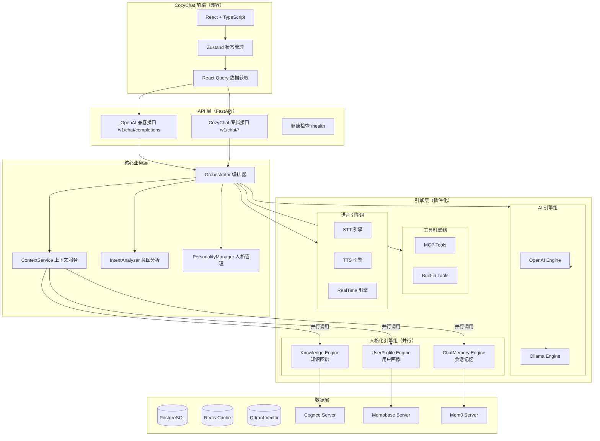

# CozyEngine 插件式人格化聊天引擎架构设计文档

> **文档版本**: v1.0  
> **创建日期**: 2026-01-09  
> **项目定位**: CozyEngine 下独立的人格化插件式聊天引擎  
> **兼容性**: 兼容 CozyChat 前端 + OpenAI API 标准  

---

## 目录

- [1. 项目背景与重构目标](#1-项目背景与重构目标)
- [2. 现有架构分析](#2-现有架构分析)
- [3. 新架构设计](#3-新架构设计)
- [4. 核心组件详解](#4-核心组件详解)
- [5. 插件化引擎接口规范](#5-插件化引擎接口规范)
- [6. API 接口设计](#6-api-接口设计)
- [7. 实施计划](#7-实施计划)
- [8. 测试策略](#8-测试策略)
- [9. 后续文档完善建议](#9-后续文档完善建议)

---

## 1. 项目背景与重构目标

### 1.1 背景

CozyChat 项目已完成基础开发，实现了以下核心能力：
- 基于 FastAPI 的后端服务
- React + TypeScript 前端
- OpenAI/Ollama 双 AI 引擎
- 记忆管理系统（Qdrant/ChromaDB）
- 工具系统（MCP 协议支持）
- 语音引擎（STT/TTS/RealTime）
- 人格配置系统（YAML 驱动）

当前架构的**核心问题**是：
- 单一记忆引擎（memory/）承担所有记忆功能，职责不清晰
- 记忆系统无法满足人格化需求（知识、用户画像、会话记忆混在一起）
- 引擎可插拔性不足，替换成本高
- 部分模块文件过大（chat.py 1537行、builder.py 952行）

### 1.2 重构目标

| 目标 | 描述 |
|------|------|
| **职责分离** | 将单一记忆引擎拆分为三个专业化引擎 |
| **人格化增强** | Knowledge + UserProfile + ChatMemory 三引擎并行 |
| **插件化架构** | 每个引擎独立可插拔，支持工厂模式 |
| **API 兼容** | 兼容 CozyChat 前端 + OpenAI API 标准 |
| **性能提升** | 并行调用 + 多级缓存，目标 QPS≥20 |
| **可维护性** | 拆分大文件，明确模块边界 |

### 1.3 核心设计原则

```
┌─────────────────────────────────────────────────────────────────┐
│                    CozyEngine 设计原则                           │
├─────────────────────────────────────────────────────────────────┤
│  1. 分层架构：API层 → 业务层 → 引擎层 → 数据层                   │
│  2. 依赖注入：使用 FastAPI Depends 实现                          │
│  3. 工厂模式：引擎创建统一通过 Factory                           │
│  4. 接口抽象：每个引擎继承统一基类 (Base)                         │
│  5. 并行优化：三大引擎异步并行调用                                │
│  6. 降级策略：引擎故障时返回空数据，不中断服务                    │
│  7. 配置驱动：所有引擎通过配置文件管理                            │
└─────────────────────────────────────────────────────────────────┘
```

---

## 2. 现有架构分析

### 2.1 当前架构图

```
┌─────────────────────────────────────────────────────────────┐
│                     CozyChat 应用层                          │
│  ┌─────────────────────────────────────────────────────┐   │
│  │             API 路由 (api/v1/chat.py)               │   │
│  └─────────────────────────────────────────────────────┘   │
│                            ▼                                 │
│  ┌─────────────────────────────────────────────────────┐   │
│  │        ChatService / ContextService (修改)          │   │
│  │   - 集成记忆引擎                                     │   │
│  │   - 构建上下文                                       │   │
│  └─────────────────────────────────────────────────────┘   │
└─────────────────────────────────────────────────────────────┘
                            ▼
┌─────────────────────────────────────────────────────────────┐
│                   引擎层 (app/engines/)                      │
│  ┌────────────────────────────────────────────────────┐    │
│  │  ai/           ← AI引擎（OpenAI/Ollama）          │    │
│  ├────────────────────────────────────────────────────┤    │
│  │  memory/       ← 单一记忆引擎（❌ 需拆分）          │    │
│  │  ├── qdrant_engine.py                              │    │
│  │  ├── chromadb_engine.py                            │    │
│  │  └── ...                                           │    │
│  ├────────────────────────────────────────────────────┤    │
│  │  tools/        ← 工具引擎（MCP）                   │    │
│  ├────────────────────────────────────────────────────┤    │
│  │  voice/        ← 语音引擎（STT/TTS/RealTime）      │    │
│  └────────────────────────────────────────────────────┘    │
└─────────────────────────────────────────────────────────────┘
```

### 2.2 现有架构优缺点对比

| 维度 | ✅ 优点 | ⚠️ 缺点 |
|------|--------|---------|
| **分层设计** | API层、业务层、引擎层职责明确 | 部分模块职责过重（chat.py 1537行） |
| **依赖注入** | FastAPI Depends 实现，便于测试和维护 | 依赖关系可以更清晰 |
| **模块化** | 每个引擎独立实现，易于扩展 | 记忆引擎过于复杂，承担多种职责 |
| **可测试性** | 工厂模式支持 Mock | 大文件难以单元测试 |
| **性能优化** | 缓存、异步、连接池优化完善 | 记忆引擎缺少并行能力 |
| **错误处理** | 全局异常处理器 + 结构化日志 | 错误类型不够细化，缺少降级策略 |
| **配置管理** | 配置文件集中管理 | 记忆系统配置项过多 |
| **测试覆盖** | 后端 80% 覆盖率，前端 0% | 集成测试、E2E 测试缺失 |
| **文档** | 文档齐全（50+ 文档） | 文档可能与代码不同步 |

### 2.3 需规避的历史缺陷

```
┌─────────────────────────────────────────────────────────────┐
│                   需规避的历史缺陷清单                         │
├─────────────────────────────────────────────────────────────────┤
│  ❌ 大文件问题                                                │
│     - chat.py (1537行) → 拆分为多个服务类                      │
│     - builder.py (952行) → 拆分为 ContextBuilder + 评分服务     │
│     - orchestrator.py (552行) → 拆分为策略类                   │
├─────────────────────────────────────────────────────────────────┤
│  ❌ 职责不清                                                  │
│     - 单一 memory/ 引擎 → 三大人格化引擎（Knowledge/UserProfile/ChatMemory）│
├─────────────────────────────────────────────────────────────────┤
│  ❌ 代码重复                                                  │
│     - 消息保存逻辑重复（流式/非流式）→ 提取公共函数             │
│     - 记忆检索逻辑重复 → 提取为独立服务                        │
├─────────────────────────────────────────────────────────────────┤
│  ❌ 错误处理不统一                                            │
│     - 缺少异常类层次结构 → 建立 CozyError 基类                 │
│     - 缺少自动重试和降级 → 添加重试装饰器                      │
├─────────────────────────────────────────────────────────────────┤
│  ❌ 测试覆盖不足                                              │
│     - 集成测试缺失 → 补充核心流程集成测试                      │
│     - E2E 测试缺失 → 添加关键用户场景测试                      │
└─────────────────────────────────────────────────────────────┘
```

---

## 3. 新架构设计

### 3.1 总体架构图



### 3.2 核心架构原则

```
┌─────────────────────────────────────────────────────────────────┐
│                    新架构核心原则                                │
├─────────────────────────────────────────────────────────────────┤
│                                                                 │
│   ┌─────────────┐    ┌─────────────┐    ┌─────────────┐        │
│   │  Knowledge  │    │ UserProfile │    │ ChatMemory  │        │
│   │   Engine    │    │   Engine    │    │   Engine    │        │
│   └──────┬──────┘    └──────┬──────┘    └──────┬──────┘        │
│          │                  │                  │                │
│          └──────────────────┼──────────────────┘                │
│                             │                                   │
│                             ▼                                   │
│                    ┌─────────────────┐                          │
│                    │  IntentAnalyzer │                          │
│                    │  (意图驱动调用)  │                          │
│                    └─────────────────┘                          │
│                                                                 │
│   ✅ 三引擎并行调用，最大延迟 = max(T1, T2, T3)                  │
│   ✅ 意图分析决定启用哪些引擎（减少不必要的调用）                 │
│   ✅ 每个引擎独立可插拔（工厂模式）                               │
│   ✅ 统一的基类接口（Base Class）                                │
│                                                                 │
└─────────────────────────────────────────────────────────────────┘
```

### 3.3 三大人格化引擎职责

| 引擎 | 数据类型 | 时效性 | 更新频率 | 典型用途 |
|------|---------|--------|---------|---------|
| **Knowledge** | 静态知识、专业信息 | 长期稳定 | 低（小时/天） | 回答专业问题、提供背景知识 |
| **UserProfile** | 用户特征、偏好、习惯 | 中长期 | 中（分钟/小时） | 个性化回复、理解用户需求 |
| **ChatMemory** | 会话历史、短期上下文 | 短期 | 高（秒/分钟） | 保持对话连贯、指代消解 |

---

## 4. 核心组件详解

### 4.1 引擎基类设计

```python
# app/engines/base.py
from abc import ABC, abstractmethod
from typing import Any, Dict, List, Optional
from enum import Enum

class EngineType(Enum):
    AI = "ai"
    KNOWLEDGE = "knowledge"
    USERPROFILE = "userprofile"
    CHATMEMORY = "chatmemory"
    TOOLS = "tools"
    VOICE = "voice"

class EngineBase(ABC):
    """所有引擎的基类"""

    def __init__(self, config: Dict[str, Any]):
        self.config = config
        self._initialized = False
        self._health = False

    @abstractmethod
    async def initialize(self) -> bool:
        """初始化引擎（连接 SDK/数据库）"""
        pass

    @abstractmethod
    async def health_check(self) -> bool:
        """健康检查"""
        pass

    @abstractmethod
    async def close(self):
        """清理资源"""
        pass

    @property
    def engine_type(self) -> EngineType:
        """返回引擎类型"""
        raise NotImplementedError
```

### 4.2 引擎工厂设计

```python
# app/engines/factory.py
from typing import Dict, Any, Type
from app.engines.base import EngineBase, EngineType
from app.engines.ai.openai_engine import OpenAIEngine
from app.engines.ai.ollama_engine import OllamaEngine
from app.engines.knowledge.cognee_engine import CogneeKnowledgeEngine
from app.engines.userprofile.memobase_engine import MemobaseUserProfileEngine
from app.engines.chatmemory.mem0_engine import Mem0ChatMemoryEngine

class EngineFactory:
    """引擎工厂 - 支持可插拔式引擎创建"""

    _registry: Dict[str, Dict[EngineType, Type[EngineBase]]] = {}

    @classmethod
    def register(cls, provider: str, engine_type: EngineType, engine_class: Type[EngineBase]):
        """注册引擎类"""
        if provider not in cls._registry:
            cls._registry[provider] = {}
        cls._registry[provider][engine_type] = engine_class

    @classmethod
    def create_engine(
        cls,
        provider: str,
        engine_type: EngineType,
        config: Dict[str, Any]
    ) -> EngineBase:
        """创建引擎实例"""
        if provider not in cls._registry:
            raise ValueError(f"Unknown engine provider: {provider}")

        if engine_type not in cls._registry[provider]:
            raise ValueError(f"Provider {provider} does not support {engine_type}")

        engine_class = cls._registry[provider][engine_type]
        return engine_class(config)

# 注册默认引擎
EngineFactory.register("openai", EngineType.AI, OpenAIEngine)
EngineFactory.register("ollama", EngineType.AI, OllamaEngine)
EngineFactory.register("cognee", EngineType.KNOWLEDGE, CogneeKnowledgeEngine)
EngineFactory.register("memobase", EngineType.USERPROFILE, MemobaseUserProfileEngine)
EngineFactory.register("mem0", EngineType.CHATMEMORY, Mem0ChatMemoryEngine)
```

### 4.3 ContextService 集成

```python
# app/services/context/context_service.py
from typing import Dict, Any, List, Optional
import asyncio
from app.engines.base import EngineBase, EngineType
from app.engines.factory import EngineFactory
from app.services.context.intent_analyzer import IntentAnalyzer, QueryIntent

class ContextService:
    """上下文服务 - 集成三大人格化引擎"""

    def __init__(self, settings):
        # 通过工厂创建三大引擎
        self.knowledge_engine: EngineBase = EngineFactory.create_engine(
            provider=settings.knowledge_engine_provider,
            engine_type=EngineType.KNOWLEDGE,
            config=settings.knowledge_engine_config
        )

        self.userprofile_engine: EngineBase = EngineFactory.create_engine(
            provider=settings.userprofile_engine_provider,
            engine_type=EngineType.USERPROFILE,
            config=settings.userprofile_engine_config
        )

        self.chatmemory_engine: EngineBase = EngineFactory.create_engine(
            provider=settings.chatmemory_engine_provider,
            engine_type=EngineType.CHATMEMORY,
            config=settings.chatmemory_engine_config
        )

        self.intent_analyzer = IntentAnalyzer()

    async def initialize(self) -> bool:
        """并行初始化所有引擎"""
        results = await asyncio.gather(
            self.knowledge_engine.initialize(),
            self.userprofile_engine.initialize(),
            self.chatmemory_engine.initialize(),
            return_exceptions=True
        )
        return all(not isinstance(r, Exception) for r in results)

    async def build_personalized_context(
        self,
        user_id: str,
        session_id: str,
        query: str,
        **kwargs
    ) -> Dict[str, Any]:
        """构建个性化上下文"""
        # 1. 分析意图
        intent = self.intent_analyzer.analyze_intent(query, {})
        engine_config = self.intent_analyzer.get_engine_config(intent)

        # 2. 条件性并行调用引擎
        tasks = {}
        if engine_config["knowledge"]["enabled"]:
            tasks["knowledge"] = self._fetch_knowledge(query, **kwargs)
        if engine_config["userprofile"]["enabled"]:
            tasks["profile"] = self._fetch_profile(user_id, **kwargs)
        if engine_config["chatmemory"]["enabled"]:
            tasks["memories"] = self._fetch_memories(user_id, session_id, query, **kwargs)

        # 3. 并行执行（带超时）
        results = {}
        try:
            done, pending = await asyncio.wait(
                [asyncio.create_task(task) for task in tasks.values()],
                timeout=1.0,
                return_when=asyncio.ALL_COMPLETED
            )

            for name, task in zip(tasks.keys(), done):
                try:
                    results[name] = await task
                except Exception as e:
                    results[name] = self._get_empty_result(name)

            for task in pending:
                task.cancel()

        except Exception as e:
            results = {name: self._get_empty_result(name) for name in tasks.keys()}

        # 4. 添加元数据
        results["intent"] = intent.value
        results["debug"] = {"enabled_engines": list(tasks.keys())}

        return results

    async def close(self):
        """清理所有引擎"""
        await asyncio.gather(
            self.knowledge_engine.close(),
            self.userprofile_engine.close(),
            self.chatmemory_engine.close(),
            return_exceptions=True
        )
```

---

## 5. 插件化引擎接口规范

### 5.1 引擎目录结构

```
backend/app/engines/
├── __init__.py
├── base.py                      # EngineBase 基类
├── factory.py                   # EngineFactory 工厂
├── factory_types.py             # 类型定义
│
├── ai/                          # AI 引擎（保持不变）
│   ├── __init__.py
│   ├── base.py                 # AIEngineBase
│   ├── factory.py              # AIEngineFactory
│   ├── openai_engine.py        # OpenAI 实现
│   └── ollama_engine.py        # Ollama 实现
│
├── knowledge/                   # 知识引擎（新增）
│   ├── __init__.py
│   ├── base.py                 # KnowledgeEngineBase
│   ├── factory.py              # KnowledgeEngineFactory
│   ├── cognee_engine.py        # Cognee 实现
│   └── models.py               # 知识数据模型
│
├── userprofile/                 # 用户画像引擎（新增）
│   ├── __init__.py
│   ├── base.py                 # UserProfileEngineBase
│   ├── factory.py              # UserProfileEngineFactory
│   ├── memobase_engine.py      # Memobase 实现
│   └── models.py               # 画像数据模型
│
├── chatmemory/                  # 会话记忆引擎（新增）
│   ├── __init__.py
│   ├── base.py                 # ChatMemoryEngineBase
│   ├── factory.py              # ChatMemoryEngineFactory
│   ├── mem0_engine.py          # Mem0 实现
│   └── models.py               # 记忆数据模型
│
├── tools/                       # 工具引擎（保持不变）
└── voice/                       # 语音引擎（保持不变）
```

### 5.2 引擎接口定义

```python
# app/engines/knowledge/base.py
from abc import ABC, abstractmethod
from typing import Any, Dict, List, Optional

class KnowledgeEngineBase(ABC):
    """知识引擎基类"""

    @abstractmethod
    async def initialize(self) -> bool:
        pass

    @abstractmethod
    async def health_check(self) -> bool:
        pass

    @abstractmethod
    async def search_knowledge(
        self,
        query: str,
        dataset_names: Optional[List[str]] = None,
        top_k: int = 5,
        **kwargs
    ) -> List[Dict[str, Any]]:
        """搜索知识

        Args:
            query: 查询文本
            dataset_names: 数据集名称列表
            top_k: 返回结果数量

        Returns:
            List[Dict]: 知识搜索结果列表
        """
        pass

    @abstractmethod
    async def add_knowledge(
        self,
        content: str,
        dataset_name: str,
        metadata: Optional[Dict[str, Any]] = None,
        **kwargs
    ) -> str:
        """添加知识

        Returns:
            str: 知识ID
        """
        pass

    @abstractmethod
    async def close(self):
        pass
```

### 5.3 插件注册机制

```python
# app/engines/plugins/__init__.py
"""插件注册机制 - 支持动态加载引擎插件"""

from typing import Dict, Type, List
from app.engines.base import EngineBase, EngineType

class PluginRegistry:
    """插件注册表"""

    _plugins: Dict[str, Dict[EngineType, Type[EngineBase]]] = {}

    @classmethod
    def register(cls, name: str, engine_type: EngineType, engine_class: Type[EngineBase]):
        """注册插件"""
        if name not in cls._plugins:
            cls._plugins[name] = {}
        cls._plugins[name][engine_type] = engine_class

    @classmethod
    def get_plugin(cls, name: str, engine_type: EngineType) -> Type[EngineBase]:
        """获取插件类"""
        return cls._plugins.get(name, {}).get(engine_type)

    @classmethod
    def list_plugins(cls) -> List[str]:
        """列出所有已注册的插件"""
        return list(cls._plugins.keys())

# 内置插件自动注册
def load_builtin_plugins():
    """加载内置引擎插件"""
    from app.engines.ai.openai_engine import OpenAIEngine
    from app.engines.ai.ollama_engine import OllamaEngine
    from app.engines.knowledge.cognee_engine import CogneeKnowledgeEngine
    from app.engines.userprofile.memobase_engine import MemobaseUserProfileEngine
    from app.engines.chatmemory.mem0_engine import Mem0ChatMemoryEngine

    PluginRegistry.register("openai", EngineType.AI, OpenAIEngine)
    PluginRegistry.register("ollama", EngineType.AI, OllamaEngine)
    PluginRegistry.register("cognee", EngineType.KNOWLEDGE, CogneeKnowledgeEngine)
    PluginRegistry.register("memobase", EngineType.USERPROFILE, MemobaseUserProfileEngine)
    PluginRegistry.register("mem0", EngineType.CHATMEMORY, Mem0ChatMemoryEngine)
```

---

## 6. API 接口设计

### 6.1 OpenAI 兼容接口

```python
# app/api/v1/openai_compatible.py
from fastapi import APIRouter, Request
from openai.types.chat import ChatCompletion
from app.services.orchestrator.chat_orchestrator import ChatOrchestrator

router = APIRouter(prefix="/v1", tags=["OpenAI 兼容"])

@router.post("/chat/completions")
async def chat_completions(request: Request) -> ChatCompletion:
    """OpenAI 兼容的聊天完成接口"""
    # 1. 解析请求
    body = await request.json()
    messages = body.get("messages", [])
    model = body.get("model", "cozy-chat")
    stream = body.get("stream", False)

    # 2. 调用编排器
    orchestrator = ChatOrchestrator()
    result = await orchestrator.process_chat(
        messages=messages,
        model=model,
        stream=stream
    )

    # 3. 返回 OpenAI 格式响应
    return ChatCompletion(
        id=f"chatcmpl-{uuid.uuid4().hex[:8]}",
        object="chat.completion",
        created=int(time.time()),
        model=model,
        choices=[
            {
                "index": 0,
                "message": {
                    "role": "assistant",
                    "content": result["content"]
                },
                "finish_reason": "stop"
            }
        ],
        usage={
            "prompt_tokens": result["usage"]["prompt_tokens"],
            "completion_tokens": result["usage"]["completion_tokens"],
            "total_tokens": result["usage"]["total_tokens"]
        }
    )
```

### 6.2 CozyChat 专属接口

```python
# app/api/v1/chat.py
from fastapi import APIRouter, Depends
from typing import List

router = APIRouter(prefix="/v1/chat", tags=["CozyChat 专属"])

@router.post("/sessions")
async def create_session(user_id: str = Depends(get_current_user)):
    """创建新会话"""
    pass

@router.get("/sessions")
async def list_sessions(user_id: str = Depends(get_current_user)):
    """获取会话列表"""
    pass

@router.post("/sessions/{session_id}/messages")
async def send_message(
    session_id: str,
    message: MessageRequest,
    user_id: str = Depends(get_current_user)
) -> MessageResponse:
    """发送消息"""
    pass

@router.get("/sessions/{session_id}/messages")
async def get_messages(
    session_id: str,
    limit: int = 50,
    user_id: str = Depends(get_current_user)
) -> List[MessageResponse]:
    """获取消息历史"""
    pass

@router.delete("/sessions/{session_id}")
async def delete_session(
    session_id: str,
    user_id: str = Depends(get_current_user)
):
    """删除会话"""
    pass
```

### 6.3 健康检查接口

```python
# app/api/v1/health.py
from fastapi import APIRouter
from typing import Dict, Any

router = APIRouter(prefix="/v1/health", tags=["健康检查"])

@router.get("")
async def health_check() -> Dict[str, Any]:
    """整体健康检查"""
    return {
        "status": "healthy",
        "version": "2.0.0",
        "engines": {
            "ai": "healthy",
            "knowledge": "healthy",
            "userprofile": "healthy",
            "chatmemory": "healthy",
            "tools": "healthy",
            "voice": "healthy"
        }
    }

@router.get("/engines")
async def engines_health() -> Dict[str, Any]:
    """各引擎健康检查"""
    # 检查每个引擎的 health_check() 方法
    pass
```

---

## 7. 实施计划

### 7.1 阶段划分

| 阶段 | 任务 | 天数 | 状态 |
|------|------|------|------|
| **阶段一：准备** | Git 备份、创建目录结构、SDK 依赖 | 1天 | 待开始 |
| **阶段二：引擎实现** | 实现三大引擎（基类+实现+工厂） | 4天 | 待开始 |
| **阶段三：服务集成** | 修改 ContextService、API 路由 | 2天 | 待开始 |
| **阶段四：测试验证** | 单元测试、集成测试、性能测试 | 4天 | 待开始 |
| **阶段五：清理部署** | 删除旧代码、文档更新、部署 | 2天 | 待开始 |
| **总计** | | **13天** | |

### 7.2 详细任务清单

#### 阶段一：准备工作（Day 1）

- [ ] Git 分支管理
  - [ ] 创建 feature 分支：`git checkout -b feature/plugin-engine-refactor`
- [ ] 备份现有 memory/ 代码
  - [ ] `git tag -a backup-before-refactor -m "Backup before plugin engine refactor"`
  - [ ] `cp -r backend/app/engines/memory/* backup/memory_engine_old/`
- [ ] 创建新目录结构
  ```bash
  mkdir -p backend/app/engines/knowledge
  mkdir -p backend/app/engines/userprofile
  mkdir -p backend/app/engines/chatmemory
  ```
- [ ] 安装 SDK 依赖
  ```bash
  cd backend
  pip install cognee_sdk memobase mem0ai
  ```
- [ ] 更新配置文件
  - [ ] 更新 `app/config/config.py`
  - [ ] 更新 `.env.example`

#### 阶段二：引擎实现（Day 2-5）

**Day 2: Knowledge Engine**
- [ ] 实现 `knowledge/base.py`
- [ ] 实现 `knowledge/cognee_engine.py`
- [ ] 实现 `knowledge/factory.py`
- [ ] 实现 `knowledge/models.py`
- [ ] 编写单元测试

**Day 3: UserProfile Engine**
- [ ] 实现 `userprofile/base.py`
- [ ] 实现 `userprofile/memobase_engine.py`
- [ ] 实现 `userprofile/factory.py`
- [ ] 实现 `userprofile/models.py`
- [ ] 编写单元测试

**Day 4: ChatMemory Engine**
- [ ] 实现 `chatmemory/base.py`
- [ ] 实现 `chatmemory/mem0_engine.py`
- [ ] 实现 `chatmemory/factory.py`
- [ ] 实现 `chatmemory/models.py`
- [ ] 编写单元测试

**Day 5: 三引擎集成测试**
- [ ] 三大引擎并行初始化测试
- [ ] 三大引擎并行查询测试
- [ ] 异常场景测试

#### 阶段三：服务集成（Day 6-7）

**Day 6: ContextService 修改**
- [ ] 修改 `services/context/context_service.py`
- [ ] 集成三大引擎工厂
- [ ] 实现并行调用逻辑
- [ ] 实现降级策略

**Day 7: API 路由修改**
- [ ] 修改 `api/v1/chat.py`
- [ ] 修改 `api/v1/openai_compatible.py`
- [ ] 修改 `api/v1/health.py`
- [ ] 添加引擎健康检查端点

#### 阶段四：测试验证（Day 8-11）

**Day 8-9: 单元测试**
- [ ] 运行所有单元测试
- [ ] 修复测试失败
- [ ] 确保覆盖率 ≥85%

**Day 10: 集成测试**
- [ ] 端到端聊天流程测试
- [ ] 三引擎并行性能测试
- [ ] 异常场景测试

**Day 11: 回归测试**
- [ ] 运行完整测试套件
- [ ] 确保所有测试通过
- [ ] 代码审查

#### 阶段五：清理部署（Day 12-13）

**Day 12: 删除旧代码**
- [ ] 删除 `engines/memory/`
- [ ] 检查并删除所有旧的 `MemoryManager` 引用
- [ ] 删除旧的 memory 相关测试

**Day 13: 文档和部署**
- [ ] 更新文档
- [ ] 部署前检查
- [ ] 合并到 main

---

## 8. 测试策略

### 8.1 测试分层

```
┌─────────────────────────────────────────────────────────────┐
│                       测试金字塔                             │
├─────────────────────────────────────────────────────────────┤
│                                                             │
│                    ┌─────────────┐                          │
│                    │   E2E 测试   │  10%                    │
│                    │  (关键场景)   │                        │
│                    └──────┬──────┘                          │
│                           │                                 │
│              ┌────────────┼────────────┐                    │
│              ▼            ▼            ▼                    │
│       ┌──────────┐ ┌──────────┐ ┌──────────┐               │
│       │集成测试  │ │集成测试  │ │集成测试  │  30%           │
│       │(三引擎)  │ │(API)     │ │(上下文)  │                 │
│       └────┬─────┘ └────┬─────┘ └────┬─────┘               │
│            │            │            │                      │
│            └────────────┼────────────┘                      │
│                         ▼                                   │
│              ┌─────────────────────┐                        │
│              │     单元测试        │  60%                   │
│              │ (每个引擎独立测试)   │                        │
│              └─────────────────────┘                        │
│                                                             │
└─────────────────────────────────────────────────────────────┘
```

### 8.2 单元测试示例

```python
# tests/unit/engines/knowledge/test_cognee_engine.py
import pytest
from unittest.mock import AsyncMock, Mock
from app.engines.knowledge.cognee_engine import CogneeKnowledgeEngine

@pytest.fixture
def mock_cognee_client(mocker):
    """Mock CogneeClient"""
    client = AsyncMock()
    client.health_check = AsyncMock(return_value=Mock(status="ok"))
    client.search = AsyncMock(return_value=[
        {"text": "test knowledge", "score": 0.95, "metadata": {}, "dataset_name": "test"}
    ])
    mocker.patch("app.engines.knowledge.cognee_engine.CogneeClient", return_value=client)
    return client

@pytest.mark.asyncio
async def test_initialize_success(mock_cognee_client):
    """测试：初始化成功"""
    config = {"api_url": "http://test", "api_token": "test_token"}
    engine = CogneeKnowledgeEngine(config)

    result = await engine.initialize()

    assert result is True
    assert engine._initialized is True
    mock_cognee_client.health_check.assert_called_once()

@pytest.mark.asyncio
async def test_search_knowledge_success(mock_cognee_client):
    """测试：搜索知识成功"""
    config = {"api_url": "http://test", "api_token": "test_token"}
    engine = CogneeKnowledgeEngine(config)
    await engine.initialize()

    results = await engine.search_knowledge(query="test", dataset_names=["test"], top_k=5)

    assert len(results) == 1
    assert results[0]["content"] == "test knowledge"
    assert results[0]["score"] == 0.95
    mock_cognee_client.search.assert_called_once()
```

### 8.3 集成测试示例

```python
# tests/integration/test_three_engines_integration.py
import pytest
import asyncio
from app.services.context.context_service import ContextService

@pytest.mark.asyncio
async def test_build_personalized_context_success():
    """测试：构建个性化上下文成功"""
    context_service = ContextService()
    await context_service.initialize()

    result = await context_service.build_personalized_context(
        user_id="test_user",
        session_id="test_session",
        query="What is AI?",
        knowledge_datasets=["ai_knowledge"],
        max_profile_tokens=200,
        max_memory_results=3,
        max_knowledge_results=2
    )

    # 验证结果结构
    assert "knowledge" in result
    assert "profile" in result
    assert "memories" in result
    assert "debug" in result
    assert "intent" in result

    await context_service.close()

@pytest.mark.asyncio
async def test_parallel_engine_calls_performance():
    """测试：并行调用性能"""
    context_service = ContextService()
    await context_service.initialize()

    import time
    start = time.time()

    result = await context_service.build_personalized_context(
        user_id="test_user",
        session_id="test_session",
        query="test query"
    )

    end = time.time()
    duration = end - start

    # 并行调用应该快于串行调用（假设单次调用 200ms，串行 600ms，并行应<300ms）
    assert duration < 1.0, f"Parallel call took {duration}s, expected < 1.0s"

    await context_service.close()
```

### 8.4 性能测试指标

| 指标 | 目标值 | 检查方法 |
|------|-------|---------|
| **QPS** | ≥20 | 压力测试 |
| **P50 延迟** | <200ms | 性能监控 |
| **P95 延迟** | <500ms | 性能监控 |
| **P99 延迟** | <1000ms | 性能监控 |
| **缓存命中率** | ≥60% | 缓存统计 |
| **超时率** | <5% | 错误日志 |

---

## 9. 后续文档完善建议

### 9.1 需补充的子文档

| 文档名称 | 优先级 | 说明 |
|---------|--------|------|
| `docs/CozyEngine-配置说明.md` | P0 | 三大引擎配置详解、环境变量说明 |
| `docs/CozyEngine-API接口详细文档.md` | P0 | OpenAI 兼容接口 + CozyChat 专属接口详细说明 |
| `docs/CozyEngine-插件开发指南.md` | P1 | 如何开发自定义引擎插件 |
| `docs/CozyEngine-性能优化指南.md` | P1 | 缓存策略、超时控制、降级策略详解 |
| `docs/CozyEngine-部署指南.md` | P1 | Docker 部署、生产环境配置 |
| `docs/CozyEngine-故障排查手册.md` | P2 | 常见问题、错误码说明、解决方案 |
| `docs/CozyEngine-版本升级指南.md` | P2 | 从 v1.x 升级到 v2.0 的迁移说明 |

### 9.2 文档维护建议

```
┌─────────────────────────────────────────────────────────────┐
│                    文档维护建议                              │
├─────────────────────────────────────────────────────────────────┤
│                                                                 │
│  1. 代码即文档                                                   │
│     - 使用类型注解 + Docstring 减少重复文档                      │
│     - 使用 OpenAPI 自动生成 API 文档                            │
│                                                                 │
│  2. 文档同步机制                                                 │
│     - 代码变更时同步更新相关文档                                │
│     - PR 审查时检查文档变更                                      │
│                                                                 │
│  3. 版本化管理                                                   │
│     - 文档与代码版本同步（v1.0, v2.0）                          │
│     - CHANGELOG 记录重大变更                                    │
│                                                                 │
│  4. 示例代码                                                     │
│     - 每个 API 接口添加 curl 示例                                │
│     - 每个引擎添加使用示例                                       │
│                                                                 │
└─────────────────────────────────────────────────────────────┘
```

### 9.3 后续行动项

- [ ] 审阅本架构设计文档
- [ ] 确认三大引擎的后端服务已部署（Cognee、Memobase、Mem0）
- [ ] 开始阶段一：准备工作
- [ ] 按计划逐步实施各阶段任务
- [ ] 补充子文档（配置说明、API 详细文档、插件开发指南）

---

## 附录

### A. 参考文档

| 文档 | 位置 |
|------|------|
| 三大人格化引擎系统架构重构方案 | `docs/reports/三大人格化引擎系统架构重构方案.md` |
| 项目代码实现分析报告 | `docs/reports/62-项目代码实现分析报告.md` |
| 项目全面分析报告 | `docs/reports/27-项目全面分析报告.md` |
| 后端架构深度分析与改进方案 | `docs/reports/后端架构深度分析与改进方案.md` |

### B. 技术栈版本

| 组件 | 版本要求 |
|------|---------|
| Python | ≥3.10 |
| FastAPI | ≥0.100 |
| Pydantic | ≥2.0 |
| SQLAlchemy | ≥2.0 |
| React | ≥18.0 |
| TypeScript | ≥5.0 |

---

**文档结束**

> 本文档为 CozyEngine 插件式人格化聊天引擎的架构设计草案，后续将根据实施过程中的反馈持续迭代更新。
