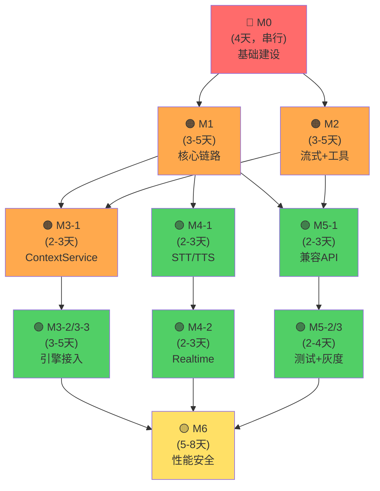

# CozyEngine v2 vibe-kanban 任务执行指南

> **文档版本**: v1.0  
> **生成日期**: 2026-02-09  
> **项目**: CozyEngine (da91073d-dde3-4c98-baad-5ff1ad321c63)  
> **总任务数**: 20  
> **建议工期**: 14-20 人天  

---

## 1. 任务总览（按阶段）

### M0：项目骨架与工程化底座（4 任务，串行）

| Task ID | 任务标题 | 依赖 | 优先级 | 工期估算 |
|---------|---------|------|--------|---------|
| `73f518bb-9e3f-41fe-b831-2902b2aaba76` | **M0-1**: 仓库结构与依赖管理 | 无 | 🔴 P0 | 2-3 天 |
| `6e3c37cb-7ceb-4fc0-8904-55f9da4fb13e` | **M0-2**: 配置系统与环境分层 | M0-1 | 🔴 P0 | 1-2 天 |
| `ea73f036-97d3-429c-80e5-abe56578fc20` | **M0-3**: 可观测与错误体系 | M0-1 | 🔴 P0 | 1-2 天 |
| `edcff342-38d4-432b-b15c-1b010593acfb` | **M0-4**: 数据库基础与迁移 | M0-2 | 🔴 P0 | 2 天 |

**关键点**：M0 是所有后续工作的基础，**必须 100% 完成** 才能开始 M1+。

---

### M1：核心聊天链路（3 任务，可部分并行）

| Task ID | 任务标题 | 依赖 | 优先级 | 工期估算 |
|---------|---------|------|--------|---------|
| `e5204f51-e5e7-49cb-bf47-7984f49a2a97` | **M1-1**: 人格系统（配置加载） | M0 全部 | 🟠 P1 | 1-2 天 |
| `e9644fbe-1886-476d-a032-f37c29d1da52` | **M1-2**: Orchestrator 主链路（非流式） | M0 全部 + M1-1 | 🟠 P1 | 2-3 天 |
| `e1602418-e852-400f-bb67-02a907f209eb` | **M1-3**: AI Engine（OpenAI provider） | M1-2 | 🟠 P1 | 1-2 天 |

**关键点**：M1-1 与 M1-2 可同时启动（都依赖 M0），M1-3 必须等 M1-2 完成。

---

### M2：SSE 流式 + 工具调用（2 任务，可与 M1 并行）

| Task ID | 任务标题 | 依赖 | 优先级 | 工期估算 |
|---------|---------|------|--------|---------|
| `2b386173-cca1-474e-8418-3eec6830e753` | **M2-1**: SSE 流式输出 | M1-3 | 🟠 P1 | 1-2 天 |
| `60f4b54e-1a5f-4d71-bcdc-f73d3ed6b183` | **M2-2**: Tools Engine 与工具调用循环 | M2-1 | 🟠 P1 | 2-3 天 |

**关键点**：M2 可在 M1-2 完成时并行启动，不阻塞 M3。

---

### M3：人格化上下文（3 任务，可与 M2 并行）

| Task ID | 任务标题 | 依赖 | 优先级 | 工期估算 |
|---------|---------|------|--------|---------|
| `83a10c0b-3ca8-4194-8ebd-5d916b48132f` | **M3-1**: ContextService（新主路径） | M1-3 + M0 全部 | 🟠 P1 | 2-3 天 |
| `7324c39e-1135-4a74-8624-95c82b9e0588` | **M3-2**: Knowledge/UserProfile/ChatMemory 引擎 | M3-1 | 🟢 P2 | 2-3 天 |
| `9151120e-00b9-45a7-8832-068b6e8fc5e0` | **M3-3**: 异步回写（画像/记忆） | M3-2 | 🟢 P2 | 1-2 天 |

**关键点**：M3-1 优先级高，解锁后续 M3-2/M3-3。

---

### M4：语音能力（2 任务，可与 M3/M5 并行）

| Task ID | 任务标题 | 依赖 | 优先级 | 工期估算 |
|---------|---------|------|--------|---------|
| `692d6da7-d113-43de-bead-f397cb68c196` | **M4-1**: STT/TTS HTTP 与流式能力 | M1-2 | 🟢 P2 | 2-3 天 |
| `16fba181-09ca-4d8e-9057-8d013373c8de` | **M4-2**: Realtime（FastRTC） | M4-1 | 🟢 P2 | 2-3 天 |

**关键点**：M4 可在 M2 启动后立即启动，不依赖 M2/M3 完成。

---

### M5：兼容层补齐（3 任务，可与 M3/M4 并行）

| Task ID | 任务标题 | 依赖 | 优先级 | 工期估算 |
|---------|---------|------|--------|---------|
| `7958e8aa-4680-44f9-a726-4a4a6b7e2d7a` | **M5-1**: CozyChat 兼容 API（最小集合） | M1-2 + M2-1 | 🟢 P2 | 2-3 天 |
| `2d946c5e-1d7e-4dc2-9e89-d759356a3fad` | **M5-2**: 对比测试与差异分析 | M5-1 | 🟢 P2 | 1-2 天 |
| `b1ccfa06-6e61-4210-ba17-b92d24d1a95f` | **M5-3**: 灰度与回滚机制 | M5-1 | 🟡 P3 | 1-2 天 |

**关键点**：M5-1 是关键，M5-2/M5-3 可并行。

---

### M6：性能/稳定性/安全加固（3 任务，顺序有要求）

| Task ID | 任务标题 | 依赖 | 优先级 | 工期估算 |
|---------|---------|------|--------|---------|
| `d2820146-2743-440d-aab2-725d2726cef0` | **M6-1**: 性能与容量 | M5-2 | 🟡 P3 | 2-3 天 |
| `7ddccbff-1724-4b09-ba17-72fb162d670d` | **M6-2**: 安全加固 | M5-3 | 🟡 P3 | 2-3 天 |
| `580ff88f-3865-4a71-8983-ee225117a0f4` | **M6-3**: 运行保障 | M6-1 + M6-2 | 🟡 P3 | 1-2 天 |

**关键点**：M6-1 与 M6-2 可并行，M6-3 最后启动。

---

## 2. 执行顺序建议

### 📋 **推荐执行路径**



---

## 3. 按优先级的执行顺序

### 🔴 **P0 - 必须优先完成（第 1 阶段）**

**工期目标**：第 1 周（4-5 天）

```
Day 1-2:  M0-1 (一人)
Day 2-3:  M0-2 (另一人，等 M0-1 完成) + M0-3
Day 3-4:  M0-4 (等 M0-2 完成)
Day 5:    完成验收与缓冲
```

**Exit Criteria**：
- [ ] `pip install` 成功
- [ ] `pytest -q` 执行
- [ ] 配置系统生效（启动时输出版本）
- [ ] health check 端点返回 200
- [ ] DB 迁移一键可复现

---

### 🟠 **P1 - 高优先级（第 2-3 阶段）**

**工期目标**：第 2-3 周（8-10 天）

**推荐配置**：2-3 人团队

```
Week 2:
  Day 1-2: M1-1, M1-2 并行启动（都依赖 M0 完成）
  Day 2-3: M2-1 与 M1-3 并行启动（按依赖）
  Day 3-4: M2-2 继续，M1 补缺陷

Week 3:
  Day 1-2: M3-1 (依赖 M1-3)
  Day 2-3: 继续 M2-2, M3-1
  Day 3-4: M3-1 完成 + 开始集成验收
```

**Exit Criteria**：
- [ ] `/v1/chat/completions` 非流式可用
- [ ] `/v1/chat/completions?stream=true` 返回 SSE
- [ ] 工具调用白名单生效
- [ ] 人格系统启动配置无错误
- [ ] 所有消息写入 DB 且关联正确

---

### 🟢 **P2 - 中优先级（并行第 2-3 周）**

**工期目标**：与 P1 并行（8-10 天）

**推荐配置**：1-2 人团队

```
与 P1 Week 2 同步启动：
  M4-1 (2-3 天) → M4-2 (2-3 天)
  M5-1 (2-3 天) → M5-2 (1-2 天) + M5-3 (1-2 天) 并行

关键节点：
  - M4-1 与 M5-1 都依赖 M1-2，尽早启动
  - M5-1 需要 M2-1 完成（流式格式一致性）
  - M4-2 依赖 M4-1，但可与其他 P2 任务并行
```

**Exit Criteria**：
- [ ] STT/TTS HTTP 端点可用
- [ ] 兼容 API 返回的字段与 CozyChat 一致
- [ ] 对比测试报告完成
- [ ] 灰度开关可通过配置控制

---

### 🟡 **P3 - 低优先级（第 4 周）**

**工期目标**：第 4 周（5-8 天）

**推荐配置**：1-2 人团队

```
Week 4:
  Day 1-2: M6-1 (性能测试) + M6-2 (安全检查) 并行
  Day 3-4: M6-3 (运行保障)
  Day 5:   Release 验收
```

**Exit Criteria**：
- [ ] 压测基线达成（P50 < X ms，P99 < Y ms）
- [ ] 安全检查清单全部通过
- [ ] 告警规则可触发
- [ ] 灰度回滚演练记录完整

---

## 4. 并行执行策略（防止冲突）

### 🎯 **团队分工建议**

#### 方案 A：2 人团队（串行方向）
```
Person A (主要负责人格化链路):
  - M0 全程参与 (4 天)
  - M1-1, M1-2, M1-3 (3-5 天)
  - M3-1, M3-2, M3-3 (5-8 天)
  - M6-2 (安全) (2-3 天)

Person B (辅助+语音/兼容):
  - M0 全程参与 (4 天)
  - M2-1, M2-2 (3-5 天)
  - M4-1, M4-2 (4-6 天)
  - M5-1, M5-2, M5-3 (5-8 天)
  - M6-1 (性能) (2-3 天)
```
**总工期**：约 20 人天 / 2 人 = **10 周**（并行化后）

---

#### 方案 B：3 人团队（加速）
```
Person A (基础设施):
  - M0 全部 (4 天)
  - M0-4 后继续优化配置/DB (3 天)
  - M6-1 (性能) (2-3 天)
  - M6-3 (运行保障) (1-2 天)

Person B (核心链路+人格化):
  - M0 参与 (1 day overlap)
  - M1 全部 (4-5 天)
  - M3-1, M3-2, M3-3 (5-8 天)
  - M6-2 (安全) 协作 (1-2 day overlap)

Person C (补充链路+兼容):
  - M0 参与 (1 day overlap)
  - M2 全部 (3-5 天)
  - M4 全部 (4-6 天)
  - M5 全部 (5-8 天)
```
**总工期**：约 20 人天 / 3 人 = **7 周**（高度并行）

---

### ⚡ **关键限流点** (Bottlenecks)

| 点 | 依赖关系 | 缓解方案 |
|---|---------|---------|
| M0-1 → 一切 | 所有后续任务 | **早启动早完成**，第 1-2 天必须 100% |
| M1-2 → M1-3, M3-1 | 核心链路 | Person B 优先集中在这里 |
| M1-3 → M2-1, M3-1 | 模型能力 | M1-3 与 M1-2 争夺人手，需 overlap |
| M5-1 → M5-2, M5-3 | 兼容性验证 | 与 M2 并行进行，但需 M2-1 完成 |

---

## 5. 批次提交与冲突预防

### 📦 **7 个批次，顺序提交**

**v1.0 已完成提交的所有 20 个任务**。以下是执行时的批次管理：

#### **Batch 1: M0 执行**（串行）
```yaml
启动时机: Day 1
执行顺序: M0-1 → 等待完成 → M0-2/M0-3 → 等待完成 → M0-4
冲突预防:
  - M0-2 blocked until M0-1 ✓
  - M0-4 blocked until M0-2 ✓
  - M0-3 可与 M0-2 并行 ✓
```

#### **Batch 2: M1 执行**（部分并行）
```yaml
启动时机: Day 5 (M0 完成)
执行顺序: 
  - M1-1 立即启动（独立）
  - M1-2 立即启动（依赖 M0）
  - M1-3 等 M1-2 完成
冲突预防:
  - M1-1 与 M1-2 无资源冲突 ✓
  - M1-3 必须整齐排队等 M1-2 ✓
```

#### **Batch 3: M2 执行**（依序）
```yaml
启动时机: Day 5-6 (M1-2/M1-3 启动)
执行顺序: M2-1 独立 → M2-2 依赖 M2-1
冲突预防:
  - M2-1 与 M1 并行，无代码冲突 ✓
  - M2-2 明确依赖标注 ✓
```

#### **Batch 4-6: M3/M4/M5 执行**（高度并行）
```yaml
启动时机: Day 7-8
执行顺序:
  - M3-1, M4-1, M5-1 同时启动（都依赖 M1-3 或 M1-2）
  - M3-2 等 M3-1
  - M4-2 等 M4-1
  - M5-2/M5-3 等 M5-1
冲突预防:
  - 三条并行线各自独立，无数据库争用 ✓
  - 每条线内有明确的串行点 ✓
平衡考量:
  - M3-1 优先级最高（影响核心链路）
  - M4 和 M5 可以独立调整进度
  - 不要让任何一条线 block 其他两条 ✓
```

#### **Batch 7: M6 执行**（可部分并行）
```yaml
启动时机: Day 14-15 (M3/M4/M5 基本完成)
执行顺序:
  - M6-1 与 M6-2 并行（都需要前序完成）
  - M6-3 等 M6-1 + M6-2
冲突预防:
  - M6-1 (性能) 与 M6-2 (安全) 无资源冲突 ✓
  - M6-3 明确依赖两者 ✓
```

---

## 6. 验收检查清单

### ✅ M0 验收标准

- [ ] `backend/app/{api,core,orchestration,context,engines,storage,middleware,observability,utils}` 目录结构完整
- [ ] `pip install` 成功，无依赖冲突
- [ ] `pytest -q` 可执行（即使暂无测试）
- [ ] `ruff check .` 无致命错误，`pyright` 配置有效
- [ ] `python app/main.py` 启动成功，输出配置信息
- [ ] `.env.example` 存在，包含所有必需密钥占位符
- [ ] `GET /health` 返回 200，包含 DB/Redis 状态
- [ ] 数据库迁移 `alembic upgrade head` 成功，可重复执行

### ✅ M1 验收标准

- [ ] `GET /v1/personalities` 返回完整列表
- [ ] 人格 YAML 配置错误时启动失败且定位正确
- [ ] `POST /v1/chat/completions` (非流式) 返回完整响应，包含 content/role/finish_reason
- [ ] 请求后立即检查 DB: sessions/messages 表记录正确
- [ ] 错误响应返回统一结构：`{error: {code, message, request_id}}`
- [ ] request_id 贯穿日志中的所有记录

### ✅ M2 验收标准

- [ ] `POST /v1/chat/completions?stream=true` 返回 SSE
- [ ] 最后一帧是 `data: [DONE]`
- [ ] 每帧符合 OpenAI delta 格式：`{choices: [{delta: {role/content/tool_calls}}]}`
- [ ] 中途断开连接，服务端日志无异常堆积
- [ ] 工具调用白名单生效，非白名单工具被拒绝
- [ ] 工具调用记录到 audit_events 表

### ✅ M3 验收标准

- [ ] ContextService 初始化成功，token 预算生效
- [ ] 三引擎全部超时 → 系统仍可用（返回空上下文 + 记录)
- [ ] 超长上下文（超过 max_tokens) 被正确裁剪
- [ ] metadata 返回完整（缓存命中/降级原因/耗时分布）

### ✅ M4 验收标准

- [ ] `POST /upload/audio` 文件上传成功返回转录文本
- [ ] WebSocket `/ws/stt` 连接后实时转录
- [ ] `POST /v1/audio/speech` 生成音频文件
- [ ] Realtime WebRTC 连接后能双向通话
- [ ] 延迟（P50）< 300ms 或符合配置值

### ✅ M5 验收标准

- [ ] `GET /sessions` / `POST /sessions` 兼容 CozyChat 返回结构
- [ ] `GET /messages` 分页正确，按时间排序
- [ ] `POST /tools/call` 执行工具成功
- [ ] 用户只能访问自己的数据（权限检查）
- [ ] 对比报告：关键字段 100% 一致

### ✅ M6 验收标准

- [ ] 压测通过：`python -m pytest tests/perf/` 达成基线
- [ ] 缓存命中率 > 50%
- [ ] 安全扫描通过：`bandit -r backend/app/`
- [ ] 告警规则可通过注入错误触发
- [ ] 灰度回滚演练记录存档到 `docs/reports/`

---

## 7. 问题排查与风险

### ⚠️ **常见卡点与解决方案**

| 卡点 | 原因 | 解决方案 |
|-----|------|---------|
| M0-4 DB 迁移失败 | PG version 不兼容或驱动缺失 | 检查 `alembic.ini`，确保 SQLAlchemy 版本匹配 |
| M1-3 模型调用超时 | API 密钥无效或网络 | 检查 `.env` 中的 OPENAI_API_KEY，测试 curl 连接 |
| M2-1 SSE 丢帧 | 缓冲或代理问题 | 加入 `X-Accel-Buffering: no` header，禁用反代缓冲 |
| M3-2 外部引擎超时 | 服务离线或 DNS 问题 | 实现熔断与重试，检查 health check 端点 |
| M5-2 对比差异过大 | 数据模型变化 | 更新对比脚本或处理差异映射 |

### 🚨 **风险清单**

| 风险 | 影响范围 | 缓解 |
|------|---------|------|
| 外部引擎（Cognee/Mem0）不稳定 | M3-2, M3-3 | 实现熔断 & 非关键路径降级 |
| FastRTC 库不支持 Mac Dev 环境 | M4-2 | 提前测试，准备备选方案（fallback to WebSocket) |
| CozyChat 旧 API 变更 | M5-1, M5-2 | 与 CozyChat 维护者沟通，冻结兼容点 |
| 压测发现性能不达 | M6-1 → 影响发布 | P50 缓冲 +50%，提前压测 |

---

## 8. 关键指标与可观测

### 📊 **每个阶段的关键指标**

#### M0-4 完成时
```
- DB connectivity: 100% (health check)
- Config loading: 100% (startup logs show version)
- Code coverage: N/A for M0
```

#### M1 完成时
```
- API response time (P50): < 500ms (non-stream)
- Error handling coverage: 100% (structured errors)
- Message write-through: 100% (all persisted to DB)
```

#### M2 完成时
```
- SSE frame delivery: 100% (no drops)
- Tool call latency (P50): < 1000ms
- Tool audit log completeness: 100%
```

#### M3 完成时
```
- Context engine parallel latency (P99): < 2000ms
- Degradation rate (any engine down): < 5%
- Cache hit ratio: > 50%
```

#### M4 完成时
```
- STT latency (P50): < 2000ms
- Realtime delay (P50): < 300ms
- Session reconnect success: > 95%
```

#### M5 完成时
```
- API compatibility score: > 95% (field alignment)
- Comparison test pass rate: 100%
```

#### M6 完成时
```
- Load test P50: target value (document it!)
- Load test P99: target value (document it!)
- Security scan findings: 0 critical
- Alert delivery latency: < 60s
```

---

## 9. 执行时间表（参考）

### **假设 3 人团队，并行执行**

```timeline
Week 1 (Feb 9 - Feb 15):
  Mon-Tue: M0-1 (all hands) ✓
  Wed:     M0-2 (all hands, depends on M0-1)
  Thu:     M0-3 + M0-4 setup
  Fri:     M0-4 (depends on M0-2)             → Buffer

Week 2 (Feb 16 - Feb 22):
  Mon-Tue: M1-1, M1-2 (parallel) + M0 fixes
  Wed:     M2-1 (Person C), M1-3 (Person B)
  Thu-Fri: M2-2 (C), M1-3 finish (B)          → Async queue for Person A

Parallel (concurrent with Week 2):
  Person A: M4-1, M4-2 progression check

Week 3 (Feb 23 - Mar 1):
  Mon-Tue: M3-1 (B, M1-3 complete) 
           M4-1 (A), M5-1 (C, M2-1 complete)
  Wed:     M3-2 (B), M4-2 (A), M5-2 (C)
  Thu-Fri: M3-3 (B), M5-3 (C)                 → M4 finalize

Week 4 (Mar 2 - Mar 8):
  Mon-Tue: M6-1 (A), M6-2 (B), M6-3 prepare (C)
  Wed-Fri: M6-3 (all hands)
           Buffer & Release validation        → Go/No-Go decision
```

---

## 10. 快速开始

### 🚀 **立即开始执行**

```bash
# 1. 查看任务列表
vibe-kanban list-tasks --project CozyEngine

# 2. 启动第一个任务（M0-1）
vibe-kanban start-task 73f518bb-9e3f-41fe-b831-2902b2aaba76

# 3. 完成任务并移至下一个
vibe-kanban complete-task 73f518bb-9e3f-41fe-b831-2902b2aaba76
vibe-kanban start-task 6e3c37cb-7ceb-4fc0-8904-55f9da4fb13e  # M0-2

# 4. 实时查看进度
vibe-kanban status --project CozyEngine --format timeline
```

---

## Appendix: 完整任务 ID 速查表

| 代码 | Task ID | 任务标题 |
|-----|---------|---------|
| M0-1 | `73f518bb-9e3f-41fe-b831-2902b2aaba76` | 仓库结构与依赖管理 |
| M0-2 | `6e3c37cb-7ceb-4fc0-8904-55f9da4fb13e` | 配置系统与环境分层 |
| M0-3 | `ea73f036-97d3-429c-80e5-abe56578fc20` | 可观测与错误体系 |
| M0-4 | `edcff342-38d4-432b-b15c-1b010593acfb` | 数据库基础与迁移 |
| M1-1 | `e5204f51-e5e7-49cb-bf47-7984f49a2a97` | 人格系统（配置加载） |
| M1-2 | `e9644fbe-1886-476d-a032-f37c29d1da52` | Orchestrator 主链路 |
| M1-3 | `e1602418-e852-400f-bb67-02a907f209eb` | AI Engine |
| M2-1 | `2b386173-cca1-474e-8418-3eec6830e753` | SSE 流式输出 |
| M2-2 | `60f4b54e-1a5f-4d71-bcdc-f73d3ed6b183` | Tools Engine |
| M3-1 | `83a10c0b-3ca8-4194-8ebd-5d916b48132f` | ContextService |
| M3-2 | `7324c39e-1135-4a74-8624-95c82b9e0588` | Knowledge/UserProfile/ChatMemory 引擎 |
| M3-3 | `9151120e-00b9-45a7-8832-068b6e8fc5e0` | 异步回写 |
| M4-1 | `692d6da7-d113-43de-bead-f397cb68c196` | STT/TTS |
| M4-2 | `16fba181-09ca-4d8e-9057-8d013373c8de` | Realtime |
| M5-1 | `7958e8aa-4680-44f9-a726-4a4a6b7e2d7a` | 兼容 API |
| M5-2 | `2d946c5e-1d7e-4dc2-9e89-d759356a3fad` | 对比测试 |
| M5-3 | `b1ccfa06-6e61-4210-ba17-b92d24d1a95f` | 灰度与回滚 |
| M6-1 | `d2820146-2743-440d-aab2-725d2726cef0` | 性能与容量 |
| M6-2 | `7ddccbff-1724-4b09-ba17-72fb162d670d` | 安全加固 |
| M6-3 | `580ff88f-3865-4a71-8983-ee225117a0f4` | 运行保障 |

---

**文档完成。准备开始执行！** 🚀
